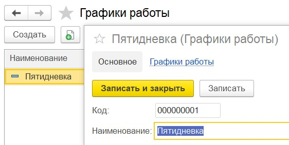

# Инструкция по начальной настройке

В конфигурацию добавлены:
- документ для работы с заявками на обслуживание клиентов;
- отправка сообщений специалистам на основании заявки клиента через телеграм-бот;
- хранение вместе с заявками на обслуживание скан-копий актов выполненных работ;
- документы для расчёта управленческой заработной платы (начисление оклада, отпуска, процента от выполненных работ, фиксированной премии и расчёт НДФЛ);
- дополнительные отчеты;
- обработка для массового создания документов Реализация товаров и услуг.

## Установка обновления "Управление IT-фирмой" и первоначальная настройка

Для перехода выполните следующие действия:
- скопируйте полученный файл конфигурации ITFirm_upd.cf в какой-нибудь каталог;
- сделайте архивную копию базы через пункт меню Администрирование - Выгрузка информационной базы;
- откройте вашу информационную базу в режиме "Конфигуратор" и откройте конфигурацию через пункт меню Администрирование - Открыть конфигурацию;
- загрузите файл конфигурации ITFirm_upd.cf через пункт меню Администрирование - Загрузить конфигурацию из файла  ;
- примените изменения: Конфигурация - Обновить конфигурацию базы данных;
- запустите конфигурацию в пользовательском режиме;
- после установки обновления для всех пользователей заново установите права доступа к информационной базе.

## Назначение ролей и профилей доступа

В конфигурацию добавлено четыре профиля пользователей:
- Менеджер - назначается пользователю ответственному за работу с клиентами и распределение заданий между пользователями с ролью Специалист;
- Специалист - назначается пользователю выполняющему заявки по выполнению работ у вашего заказчика;
- Бухгалтер ИТ-фирмы - назначается пользователю ответственному за создание документов Реализация товаров и услуг с помощью обработки Массовое создание документов;
- Кадровик-расчётчик - назначается пользователю ответственному за начисление заработной платы, премий и распределению отпусков.

Для назначения профилей доступа:
- откройте список пользователей: Администрирование - Настройки пользователей и прав - Пользователи;
- для каждого из пользователей откройте настройку его прав доступа ("Права доступа" в панели навигации формы пользователя), установите флажок для выбранного профиля и нажмите "Записать".

## Настройка работы с Телеграм-ботом
Если у вас еще нет бота в Телеграм, то создайте его: 
- открыть Телеграм в телефоне или на компьютере, найти с помощью поиска бота [BotFather](https://telegram.me/BotFather).
- написать ему в сообщении /newbot и выбрать имя, которое будет отображаться в списке контактов.
- если имя бота не занято и введено правильно, BotFather пришлет в ответ сообщение с токеном для доступа к созданному боту, который понадобится далее при настройке.
- [задать] описание бота и картинку, как описано [здесь](https://tlgrm.ru/docs/bots#edit-settings).

Для отправки сообщений через Телеграм необходимо создать группу, куда должен быть включен только что созданный бот:
- создайте группу в Телеграм;
- добавьте в группу только что созданного бота;
- назначьте боту права администратора;
- получите идентификатор группы для чего напишите любое сообщение в группу;
- с помощью браузера выполните запрос https://api.telegram.org/bot[ВашТокен]/getUpdates;
- в полученном JSON найдите идентификатор группы, в которой было получено сообщение, и сохраните его (идентификатор группы будет выглятеть как показано на картинке. 

- введите полученные токен Телеграм-бота и идентификатор Телеграм-чата в соответствующих формах: Обслуживание клиентов - Сервис.

## Настройка констант
- заполните константы Номенклатура абонентская плата, Номенклатура работы специалиста и НДФЛ: Добавленные объекты - Сервис. Значения констант Номенклатура абонентская плата и Номенклатура работы специалиста будут отображаться в табличной части "Услуги" документа "Реализации товаров и услуг" в колонке "Номенклатура".

## Настройка расчета управленческой заработной платы
- заполните графики работы организации на текущий год в подсистеме Добавленные объекты (минимум два графика: один рабочий и один для расчета отпусков). Пример заполнения графика приведен на рисунке:
    
  
- заполните справочник "Условия оплаты сотрудников" (Обслуживание клиентов - подменю См. также) для каждого сотрудника организации. 
    
